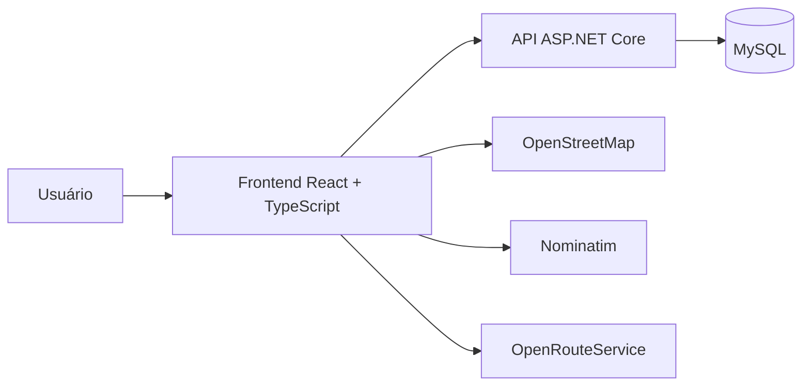

<p align="center">
  
</p>

<h1 align="center">Fast Route</h1>

<p align="center">
  Plataforma full-stack para gerenciamento de veículos, pontos de entrega e rotas da Universidade Federal do Ceará.
</p>

<p align="center">
  
  
  
  
  
</p>

## Sobre o projeto

A **Fast Route** é uma aplicação desenvolvida para apoiar o planejamento da distribuição de veículos da Universidade Federal do Ceará — UFC.

A plataforma permite cadastrar usuários, veículos e pontos de entrega, visualizar essas informações em mapas e calcular trajetos entre locais registrados.

O projeto foi desenvolvido durante a disciplina de **Projeto Integrador III** por estudantes de Ciência da Computação da UFC.

## Funcionalidades

### Usuários

- cadastro de usuário;
- login por e-mail e senha;
- consulta de perfil;
- atualização de nome, e-mail e foto;
- controle básico de sessão no frontend.

### Veículos

- cadastro de veículos;
- associação opcional do veículo a um usuário;
- identificação por placa e número;
- associação do veículo a um campus;
- listagem dos campi cadastrados;
- consulta de veículos por campus.

### Mapas e pontos de entrega

- mapa interativo com Leaflet;
- mapas baseados no OpenStreetMap;
- cadastro de pontos por clique no mapa;
- obtenção do endereço por geocodificação reversa;
- armazenamento dos pontos no banco;
- visualização dos pontos cadastrados.

### Rotas

- seleção de origem e destino;
- cálculo de trajeto para automóveis;
- exibição da rota no mapa;
- integração experimental com OpenRouteService.

## Estado das funcionalidades

| Funcionalidade | Situação |
|---|---|
| Cadastro de usuários | Implementado |
| Login integrado ao backend | Implementado |
| Consulta e edição de perfil | Implementada |
| Cadastro de veículos | Implementado |
| Consulta de veículos por campus | Implementada |
| Cadastro de pontos no mapa | Implementado |
| Persistência em MySQL | Implementada |
| Geocodificação reversa | Implementada |
| Visualização de rotas | Implementada |
| Autenticação com token | Não implementada |
| Hash seguro de senhas | Não implementado |
| Testes automatizados | Não implementados |
| Implantação em produção | Não realizada |

> [!WARNING]
> A versão atual é um protótipo acadêmico. Ela ainda não possui os controles de segurança necessários para utilização em produção.

## Arquitetura



### Frontend

Responsável pelas interfaces, mapas, formulários e comunicação com a API.

- React 18;
- TypeScript;
- Vite;
- React Leaflet;
- Leaflet;
- Lucide React;
- Fetch API.

### Backend

API REST responsável pelo acesso aos usuários, veículos e pontos de entrega.

- ASP.NET Core 8;
- Entity Framework Core;
- Pomelo Entity Framework Core para MySQL;
- Swagger/OpenAPI;
- CORS.

### Banco de dados

O projeto utiliza MySQL para armazenar:

- usuários;
- veículos;
- pontos de entrega.

O repositório também contém um esquema SQL histórico com tabelas adicionais para locais, arestas e rotas. Para a versão atual da API, recomenda-se criar o banco usando as migrations do Entity Framework.

## Serviços externos

| Serviço | Utilização |
|---|---|
| OpenStreetMap | Camadas visuais do mapa |
| Nominatim | Geocodificação reversa |
| OpenRouteService | Cálculo dos trajetos |
| Swagger | Documentação e teste da API |

## Estrutura do projeto

```text
Projeto_Integrador_III/
├── fast_route/                    # Frontend React + TypeScript
│   ├── public/
│   ├── src/
│   │   ├── assets/
│   │   ├── components/
│   │   │   ├── content/
│   │   │   │   ├── home/
│   │   │   │   ├── map/
│   │   │   │   ├── onibus/
│   │   │   │   ├── perfil/
│   │   │   │   └── rotas/
│   │   │   ├── header/
│   │   │   └── login/
│   │   ├── App.tsx
│   │   └── main.tsx
│   ├── package.json
│   └── vite.config.ts
│
├── fast_route_backend/            # API ASP.NET Core
│   ├── Controllers/
│   │   ├── MapController.cs
│   │   ├── UsuariosController.cs
│   │   └── VeiculosController.cs
│   ├── Data/
│   │   └── ApplicationDbContext.cs
│   ├── Migrations/
│   ├── Models/
│   │   ├── LoginModel.cs
│   │   ├── Usuario.cs
│   │   └── Veiculo.cs
│   ├── Program.cs
│   └── fast_route_backend.csproj
│
├── PI3-banco.sql                  # Esquema histórico do banco
└── README.md
```

## Pré-requisitos

Para executar o projeto, instale:

- Git;
- Node.js;
- npm;
- .NET 8 SDK;
- MySQL 8;
- ferramenta `dotnet-ef`.

Instale o Entity Framework CLI, caso ainda não esteja disponível:

```bash
dotnet tool install --global dotnet-ef
```

## Instalação

Clone diretamente a branch `final`:

```bash
git clone --branch final --single-branch https://github.com/EvertonTeix/Projeto_Integrador_III.git
cd Projeto_Integrador_III
```

## Configuração do banco de dados

Crie um banco vazio:

```sql
CREATE DATABASE projetointegradoriii
CHARACTER SET utf8mb4
COLLATE utf8mb4_unicode_ci;
```

Configure a conexão sem salvar a senha no repositório.

### Linux ou macOS

```bash
export ConnectionStrings__DefaultConnection="Server=localhost;Port=3306;Database=projetointegradoriii;User=SEU_USUARIO;Password=SUA_SENHA"
```

### Windows PowerShell

```powershell
$env:ConnectionStrings__DefaultConnection="Server=localhost;Port=3306;Database=projetointegradoriii;User=SEU_USUARIO;Password=SUA_SENHA"
```

Aplique as migrations:

```bash
cd fast_route_backend
dotnet restore
dotnet ef database update
```

## Executando o backend

Dentro de `fast_route_backend`:

```bash
dotnet run --launch-profile http
```

A API ficará disponível em:

```text
http://localhost:5164
```

A documentação Swagger estará em:

```text
http://localhost:5164/swagger
```

## Executando o frontend

Em outro terminal, a partir da raiz do repositório:

```bash
cd fast_route
npm ci
npm run dev
```

O Vite mostrará o endereço da aplicação, normalmente:

```text
http://localhost:5173
```

O backend precisa permanecer em execução na porta `5164`, pois essa URL está configurada diretamente no frontend atual.

## Endpoints da API

### Usuários

| Método | Endpoint | Descrição |
|---|---|---|
| `POST` | `/api/Usuarios/cadastro` | Cadastra um usuário |
| `POST` | `/api/Usuarios/login` | Verifica e-mail e senha |
| `GET` | `/api/Usuarios/{id}` | Consulta um usuário |
| `PUT` | `/api/Usuarios/{id}` | Atualiza o perfil |

### Veículos

| Método | Endpoint | Descrição |
|---|---|---|
| `POST` | `/api/Veiculos` | Cadastra um veículo |
| `GET` | `/api/Veiculos/campi` | Lista os campi cadastrados |
| `GET` | `/api/Veiculos/campus/{cidade}` | Lista veículos de um campus |

### Mapas

| Método | Endpoint | Descrição |
|---|---|---|
| `GET` | `/api/Map/locations` | Lista pontos de entrega |
| `POST` | `/api/Map/AdicionarPonto` | Cadastra um ponto |
| `GET` | `/api/Map/route` | Retorna uma rota demonstrativa |

> O endpoint `/api/Map/route` retorna atualmente uma distância fictícia. O cálculo exibido pelo frontend é feito pelo OpenRouteService.

## Equipe

| Integrante | Responsabilidades |
|---|---|
| Eric de Araújo Albuquerque | Frontend |
| Antonio Everton Coelho Teixeira | Frontend |
| Wagner Vasconcelos Dias | API de mapas e backend |
| Ana Larissa Teixeira Dantas | Prototipação, design e backend |
| Lemuel Santana de Morais | Banco de dados e backend |
